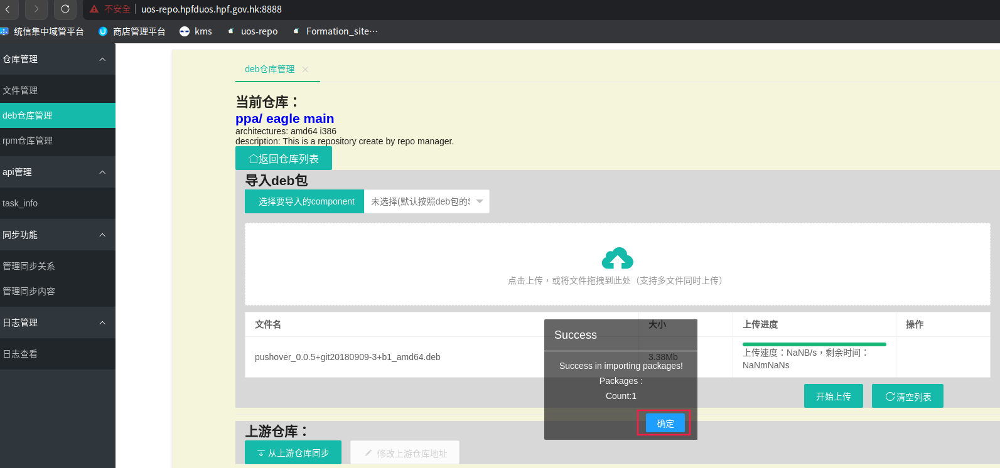

# repo-manager

- Author:zhangchiqian@foxmail.com

## introduction

该项目实现了对linux系统的deb仓库、rpm仓库、bash脚本git仓库的界面化管理，可从web界面上传下载文件，并且可以建立级联同步关系，从中心站点自动向所有下级站点推送更新。其中，deb仓库支持basic auth认证。

## deploy & run 

1.  请实现在机器上安装好docker及docker-compose环境

2.  该工具默认对外监听端口为：

    仓库： tcp：80

    管理页面： tcp：8888

    如有修改端口需要，请手动修改config-file/nginx.conf 中 listen字段即可

3. 运行install.sh脚本即可安装repo-manager

   ```bash
   # install repo-manager
   cd repo-manager
   bash install.sh
   ```

4. 安装完成后，执行bash start-server.sh start 即可运行repo-manager服务

   ```bash
   # start repo-manager
   bash start-server.sh start 
   ```

5. 执行bash start-server.sh stop 即可停止服务

   ```bash
   # stop repo-manager
   bash  start-server.sh stop
   ```

6.  所有上传到仓库的资源都会放在./data-file目录下，请保证该目录所在磁盘分区有足够空间

## web login

地址：http://<ip_address>:8888/

用户名：admin

密码：test123..

{width="6.309722222222222in"
height="2.7472222222222222in"}

修改nginx basic认证:

```bash
htpasswd -cb nginx-htpasswd <USER> <PASSWORD>
```

## manage deb repo

点击"deb仓库管理"，而后再点击"进入仓库管理"

{width="7.2625in"
height="3.0597222222222222in"}

点击页面的文件上传模块

{width="7.013194444444444in"
height="3.6006944444444446in"}

选择文件，并点击开始上传

{width="6.45in"
height="3.191666666666667in"}

{width="6.458333333333333in"
height="2.7743055555555554in"}

上传完毕后会显示成功弹窗，而后点击"确定"

{width="6.496527777777778in"
height="3.042361111111111in"}

在搜索栏输入对应包名（PackageName）进行搜索，可以显示该包相关信息，此时该deb包已成功上传至该deb仓库（注意，同一个仓库中，相同PackageName只能有一个版本）

{width="7.264583333333333in"
height="1.632638888888889in"}

如果要从仓库中删除该包，可以点击对应包搜索结果右侧的"删除"按钮即可

{width="7.2555555555555555in"
height="1.5895833333333333in"}

## repo sync

填写本级节点信息以及上级节点信息

点击确认，添加上级节点


在父节点添加同步内容


查看同步状态

父节点：


子节点


## log view


